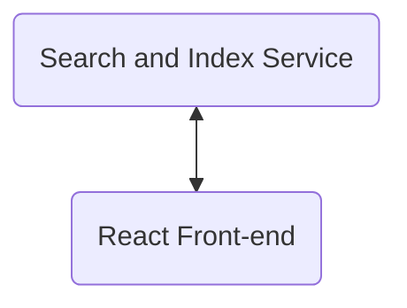

# Kibbl Service

This service provides an API which uses bloom filters to quickly search contents of markdown files.

## Kibbl - Design

Kibbl is an application designed to quickly index and make  your markdown notes searchable. On implementation, the decision was made to store the indexed files in RAM. This is because the service can recursively index 300 files and their contents into bloom filters in 2-3 seconds on moderately weak hardware, and the application uses less than 67mb RAM in use. 

Storing these in memory makes them quickly retrievable and as Kibbl is meant only to run in your notes repository, I opted for speed of search over memory usage. The memory usage is still far lower than if I'd taken the approach of building the app in Spring Boot.

